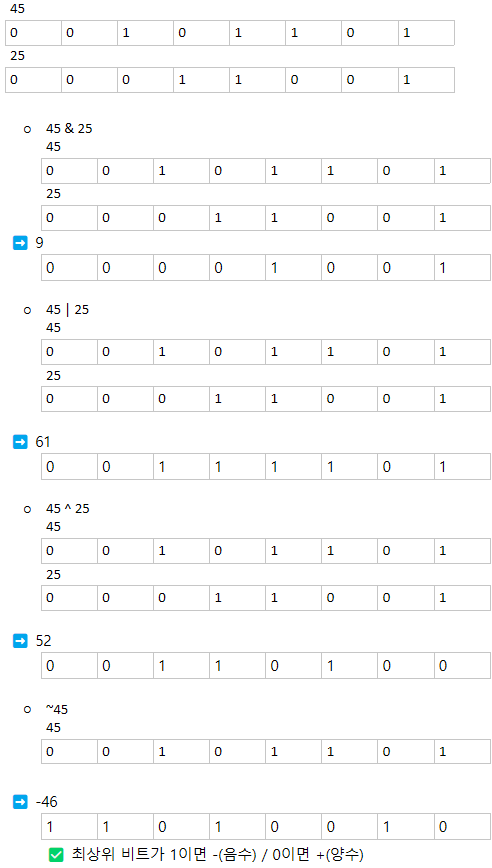
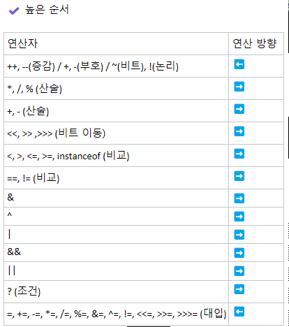

# Operator
```text
✔️ 부호 연산자
+ 피연산자 ➡️ 피연산자의 부호 유지
- 피연산자 ➡️ 피연산자의 부호 변경

	✅ 정수 타입 (byte, short, int)의 연산 결과는 int 타입
            ⭐ 부호를 변경하는 것 또한 연산
                ➡️ int 타입 변수에 대입 
            
                byte num = 100;
                byte result = -num; -> Error
                
                byte num = 100;
                int result = -num;

✔️ 증감 연산자
++피연산자 ➡️ 피연산자의 값을 1 증가
--피연산자 ➡️ 피연산자의 값을 1 감소

        피연산자++ ➡️ 다른 연산을 수행한 후 피연산자의 값을 1 증가
        피연산자-- ➡️ 다른 연산을 수행한 후 피연산자의 값을 1 감소
	
	⚠️ 증감 연산자의 위치에 따라 결과가 달라질 수 있다
			int x = 1;
			int y = 1;
			
			int result1 = ++x + 10; ➡️ 2+10=12
int result2 = y++ + 10; ➡️ 1+10=11 후 y 1 증가


✔️ 산술 연산자
+, -, *, /, %

+	덧셈
- 	뺄셈
*	곱셈
/ 	나눗셈
%	나머지

⭐ 피연산자 타입에 따른 결과값
정수 (byte, short, char, int) ➡️ int
피연산자 둘 중 하나라도 long이면 ➡️ long
실수 (float, doble) ➡️ float, doble

✔️ 오버플로우, 언더플로우
오버 플로우: 타입이 허용하는 값을 초과
언더 플로우: 타입이 허용하는 값을 미달

	⚠️ 연산 결과가 오버,언더 플로우시 Error❌
	    ➡️ 해당 타입의 최대값 or 최소값으로 돌아간다

✔️NaN 과 infinity
NaN (Not a Number) / infinity (무한대)의 처리
➡️ if 문을 사용하여 계속된 잘못된 연산 방지
boolean형으로 결과를 확인하면
Infinity, NaN 값일 경우 Ture / 아닐 경우 False 값 반환


✔️ 동등 비교
==	두 연산자 값이 같은지 비교
!= 	두 연산자가 값이 다른지 비교

✔️ 크기 비교
>	피연산자1의 값이 큰지 비교
>=	피연산자1의 값이 크거나 같은지 비교
<	피연산자1이 작은지 검사
<=	피연산자 1의 값이 작거나 같은지 비교

⭐ 비교 연산자의 결과 값은 boolean형 (true or false)

⚠️ 실수의 비교연산자
boolean result = 0.1f == 0.1;
System.out.println(result);
이때 결과값은 false

	✅ false이 나오는 이유 
	    1) 부등 소수점 방식을 사용하는 실수 타입은 0.1를 정확히 표현 불가
		2) float, double 타입의 정밀도 차이가 존재
			
✔️ 문자열 비교
equals()	==	두 문자열이 같은지 비교
!equals()	!=	두 문자열이 다른지 비교
⭐ 검사시 대소문자 구분

ex)
String str1 = "ABC";
String str2 = "ABC";

boolean result = str1.equals(str2);

✔️AND
    &	피연산자 모두가 true일 경우만 결과값 true
   &&	&와 동일 / 앞에 결과가 false일 경우 뒤 피연사자는 보지 않고 결과값 false 

✔️OR
    |	피연산자 둘 중 하나만이라도 true면 결과값 true
   ||	|와 동일 / 앞에 결과가 true일 경우 뒤 피연산자는 보지 않고 결과값 true 

✔️NOT
      !	피연산자의 논리값을 바꿈 (논리값 반전)

✔️XOR
^	피연산자 하나는 true, 하나는 false 일때만 결과값 true

✔️ 비트 논리 연산자
	bit 단위로 논리 연산 수행
	⚠️ 0,1이 피연산자이기 때문에 2진수 0,1로 저장되는
		⭐ 정수타입 (byte, short, int, long)만 피연산자로 사용 가능
	⭐ 결과값은 int 값으로 

	☑️ AND
		  &	 두 비트 모두 1일 경우에만 결과값 1
	
	☑️ OR
		   |	두 비트 중 하나라도 1이면 결과값 1
		
	☑️ NOT
		~ 	1 -> 0 / 0 -> 1 보수
	
	☑️XOR
		^ 	두 비트 중 하나는 1, 하나는 0일때만 결과값 1 
		
ex) 45 와 25의 비트 연산
```

```text
✔️ 비트 이동 연산자
	a << b	정수 a의 각 비트를 b만큼 왼쪽으로 이동
		오른쪽의 빈 자리는 0으로 채움 
		a << b == a X 2^b
		
	a >> b	정수 a의 각 비트를 b만큼 오른쪽으로 이동
	        왼쪽의 빈 자리는 최상위 부호 비트와 같은 값으로 채움 
		a >> b == a / 2^b
		
	a >>> b	정수 a의 각 비트를 b만큼 오른쪽으로 이동
		왼쪽의 빈 자리는 0으로 채움 

✔️ 단순 대입 연산자
=	피연산자의 값을 변수에 저장
⚠️ ⭐ 기본 자료형은 값을 저장 / 그 외 모든 것은 주소값을 저장 

✔️ 복합 대입 연산자
+=	변수 = 변수 + 피연산자
-=	변수 = 변수 - 피연산자
*=	변수 = 변수 * 피연산자
/= 	변수 = 변수 / 피연산자
%=	변수 = 변수 % 피연산자
&=	변수 = 변수 & 피연산자
|= 	변수 = 변수 | 피연산자
^= 	변수 = 변수 ^ 피연산자
<<=	변수 = 변수 << 피연산자
>>=	변수 = 변수 >> 피연산자
>>>= 	변수 = 변수 >>> 피연산자

✔️ 삼항(조건) 연산자
조건식(피연산자 1) ? 값 or 연산식(피연산자 2) : 값 or 연산식(피연산자 3)

조건식의 값이
ture ➡️ 피연산자 2
false ➡️ 피연산자 3 이 선택

ex)
    int score = 90;
    char grade = (score>90) ? 'A' : (score>80) ? 'B' : 'C';
	➡️ B
: 다음으로 주로 값이 오지만 경우에 따라 연산식이 오는 경우도 있음 

✔️ 연산 방향 및 우선 순위
```
